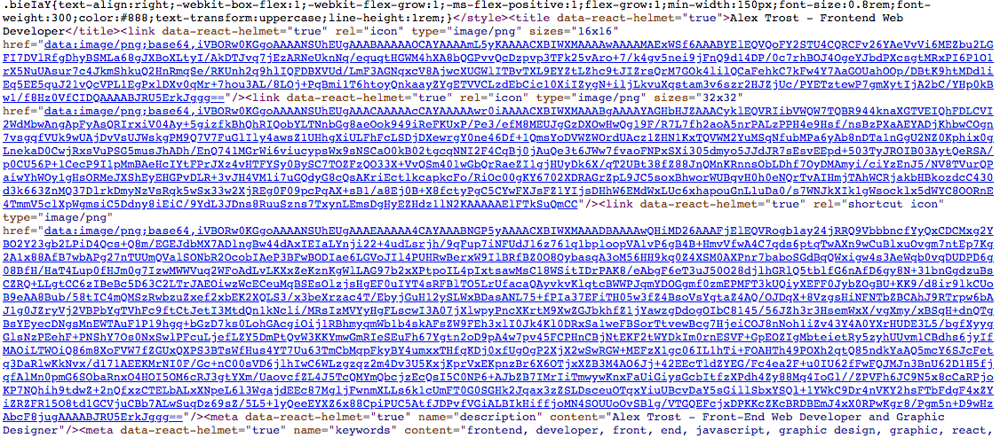

Putting together this site I had to do a bit of digging to find the best way to add a favicon. There's a [great Gatsby plugin](https://www.gatsbyjs.org/packages/gatsby-plugin-manifest/) for setting up the manifest.webmanifest, which gives you icons and theme colors for users on mobile. It's great, because you just need to point it towards a large source image and it generates all the different icon sizes. However, it stops short of making the favicon images.

If you don't know what a favicon is, it's the tiny image next to the name of a site in browser tabs.


To set this up in Gatsby you first need to find your index.js file. If you're using the gatsby-starter-default or a similar setup, it's in `/src/layouts/`. It's the file that should have your Helmet import and it should look something like [this](https://github.com/gatsbyjs/gatsby-starter-default/blob/master/src/layouts/index.js).

Once you find it, we just need to import our icons and add a prop to our Helmet. I'm using three sizes of icons. 16x16, 32x32, and 64x64.

### Import your icons

```javascript
import favicon16 from "../images/favicon16.png";
import favicon32 from "../images/favicon32.png";
import favicon64 from "../images/favicon64.png";
```

### Add link prop to Helmet

```javascript
      link={[
        { rel: 'icon', type: 'image/png', sizes: "16x16", href: `${favicon16}` },
        { rel: 'icon', type: 'image/png', sizes: "32x32", href: `${favicon32}` },
        { rel: 'shortcut icon', type: 'image/png', href: `${favicon64}` },
    ]}
```

Now my Helmet looks like this:

```javascript
<Helmet
  title={data.site.siteMetadata.title}
  meta={[
    {
      name: "description",
      content: "Alex Trost - Front-End Web Developer and Graphic Designer",
    },
    {
      name: "keywords",
      content: "frontend, developer",
    },
  ]}
  link={[
    { rel: "icon", type: "image/png", sizes: "16x16", href: `${favicon16}` },
    { rel: "icon", type: "image/png", sizes: "32x32", href: `${favicon32}` },
    { rel: "shortcut icon", type: "image/png", href: `${favicon64}` },
  ]}
/>
```

Now Gatsby will add the favicons to each page's header.

The best part is that, because they're such small images, they aren't going to be an extra network request, but Gatsby will embed them as base64 strings right in the html, so the load at the same time as the rest of the text. Here's how it looks on my page if you view source:



Hope this helps!
